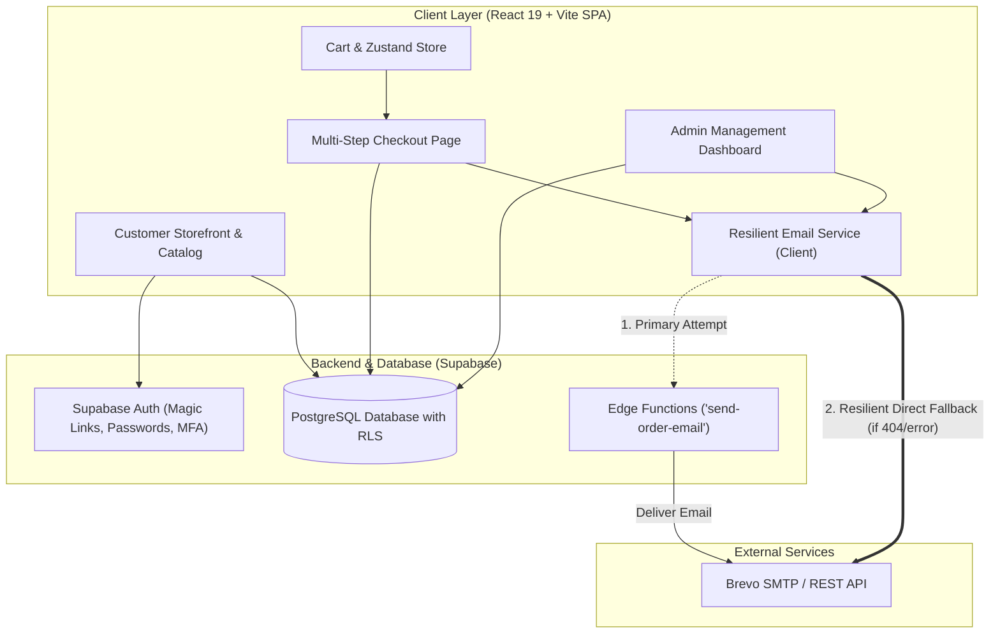
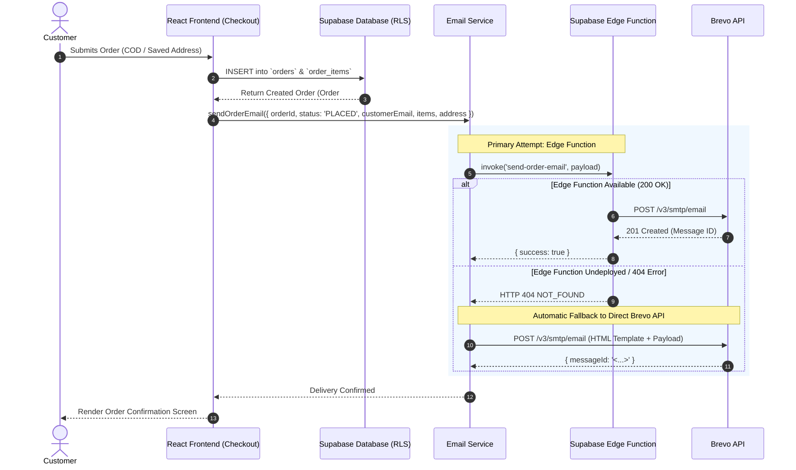
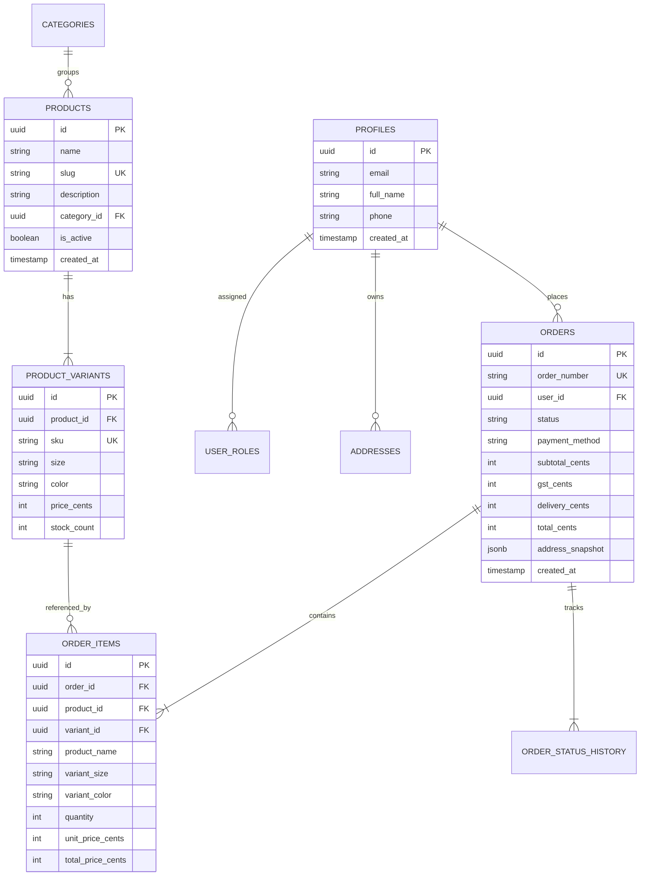

# AK QIMAASH — Modest Luxury, Redefined

A premium, full-featured modest luxury e-commerce platform crafted with modern web technologies, providing seamless shopping, responsive checkout, comprehensive admin operations, and a resilient dual-path transactional email dispatch engine.

---

## 🏛️ System Architecture Plan



---

## 🔄 Order Lifecycle & Email Delivery Flow



---

## 🗄️ Database Entity-Relationship Plan



---

## ✨ Features

- **Storefront & Catalog**: Rich collection browsing, variant selection (sizes, fabrics, colors), live stock tracking, and search.
- **Cart & Persistent State**: Frictionless cart drawer powered by Zustand with persistent local storage.
- **Checkout Pipeline**: Multi-step checkout with Singapore postal address validation, automatic GST (9%) and delivery fee calculation, and Cash-on-Delivery (COD).
- **Resilient Transactional Emails**:
  - Automatically sends responsive, branded HTML emails for every order status: `PLACED`, `CONFIRMED`, `PROCESSING`, `SHIPPED`, `OUT_FOR_DELIVERY`, `DELIVERED`, and `CANCELLED`.
  - Dual-path dispatch: tries Supabase Edge Function first, with seamless client-side fallback to Brevo API (`https://api.brevo.com/v3/smtp/email`).
- **Admin Management Suite**:
  - Dashboard analytics (orders, revenues, inventory alerts).
  - Order processing & fulfillment with courier/tracking updates.
  - Product and inventory catalog management.
  - Customer profile administration and role management (`CUSTOMER`, `MANAGER`, `ADMIN`).
- **Security & Integrity**:
  - PostgreSQL Row Level Security (RLS) policies on every table.
  - Multi-Factor Authentication (MFA) challenge page and audit logging.

---

## 🛠️ Tech Stack

- **Frontend**: React 19, TypeScript, Vite, TailwindCSS, Lucide Icons, React Hook Form, Zod.
- **State & Data**: TanStack React Query v5, Zustand.
- **Backend / Database**: Supabase (PostgreSQL 15+, Auth, Edge Functions, Row-Level Security).
- **Email Delivery**: Brevo API & SMTP Relay with responsive HTML templates.
- **Testing**: Vitest with unit tests covering commerce calculations, schema validations, and email delivery pipelines.

---

## 🚀 Getting Started

### Prerequisites
- Node.js 18+
- npm or yarn

### 1. Clone the repository
```bash
git clone https://github.com/Sivanarulanbu/AK-QIMAASH.git
cd AK-QIMAASH
```

### 2. Install dependencies
```bash
npm install
```

### 3. Configure Environment Variables
Copy `.env.example` to `.env.local`:
```bash
cp .env.example .env.local
```
Fill in your configuration:
```env
VITE_SUPABASE_URL=https://your-project.supabase.co
VITE_SUPABASE_ANON_KEY=your-supabase-anon-key
VITE_APP_URL=http://localhost:5173
VITE_APP_NAME=AK QIMAASH

# Brevo Email Configuration
VITE_BREVO_API_KEY=your-brevo-api-key
VITE_BREVO_SENDER_EMAIL=orders@akqimaash.sg
VITE_BREVO_SENDER_NAME=AK QIMAASH
```

### 4. Run Development Server
```bash
npm run dev
```

### 5. Run Tests
```bash
npm test
```

### 6. Build for Production
```bash
npm run build
```

---

## 📄 License
Private and Proprietary — AK QIMAASH. All rights reserved.
